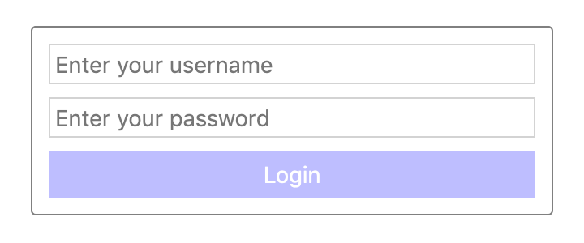
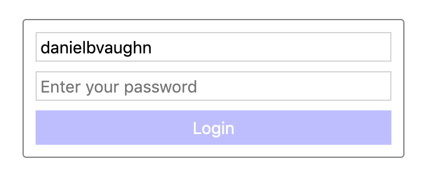
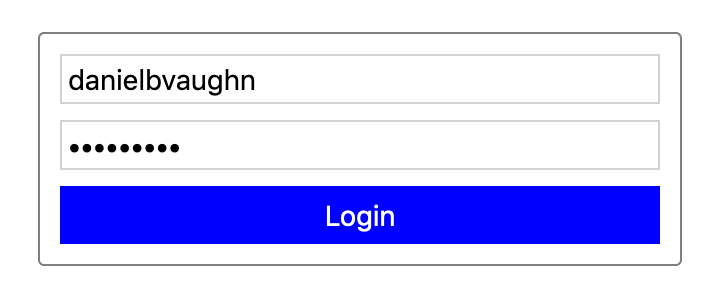
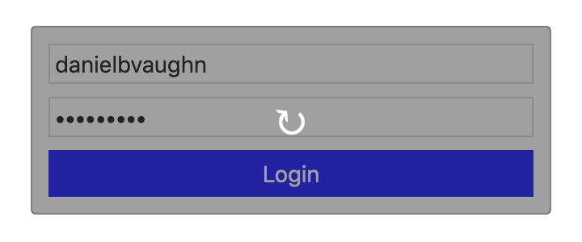

# Example

Imagine we're designing a basic login form with the 4 states shown in the screenshots below.

You can see that there is a progression from (1) an empty form that will be shown on page load, (2) the form as the user is entering their credentials, (3) the form filled out and ready for submission, and (4) a loading state while the user is being authenticated.

It's easy to imagine how these screens might be created using traditional design tools. However, while the above images are *perceptually* useful (we can obviously see the designers intention for the login form by glancing at them), they communicate very little *actionable* information to developers. How large is the font size of the login button? What happens when you hover over the username or password fields? Is the loading icon supposed to spin? If so, how fast? These are questions that static images cannot provide, and this is where traditional design tools fail.

So the question Matry is attempting to answer is, "how can a designer efficiently communicate the visual behavior of an application to a developer?" To help make sense of Matry's solution to this problem, it's useful to first try out a thought experiment. Imagine you somehow lost these images, and had to describe them in detail to a developer using nothing but words.

If you were to sit down and write out a rough draft, it might look something like the following:

> The login form has a dark gray border and a few pixels of padding. Inside are 2 text fields. By default, both text fields are empty and the placeholder text is light gray. The top text field is the username field and the placeholder text is "Enter your username". The bottom text field is the password field and the placeholder text is "Enter your password". When the user writes text into the field, the text color changes to dark gray.  

> Below the 2 text fields is a button. It has white text and a blue background, and the text is center aligned. The buttons text is "Login". By default, the opacity is 25 percent. When both the username and password fields have text, the button is set to full opacity.  

> When the login button is clicked, a dark gray overlay shows with a white loading indicator in the center.

This would be a good start! However, there is still plenty left unsaid. An example is setting the button to 25 percent opacity by default. Why would the button be at 25 percent opacity? What does it *mean* for the button to be transparent? In this case, it's meant to visually indicate that the button is disabled. But that's really only apparent from the screenshots. If we're only using text, this isn't very clear. The solution to this problem is to define this visual state semantically. So let's rewrite the second paragraph to reflect this:

> Below the 2 text fields is a button. It has white text and a blue background, and the text is center aligned. The buttons text is "Login". The button can be disabled or enabled. When the button is disabled, it is set to 25 percent opacity. When it is enabled, it is set to full opacity. By default, the button is disabled. When both the username and password fields have text, the button is enabled.

It is now possible for the developer to understand not only the design *value* (25% opacity), but also the design *intent* (opacity is used to indicate enabled/disabled). But let's now imagine that you have to verbally describe several other screens that also use buttons in different ways. You'll have to redefine the connection between opacity and enabled/disabled each time. Wouldn't it be more efficient, then, if each component were defined separately?
