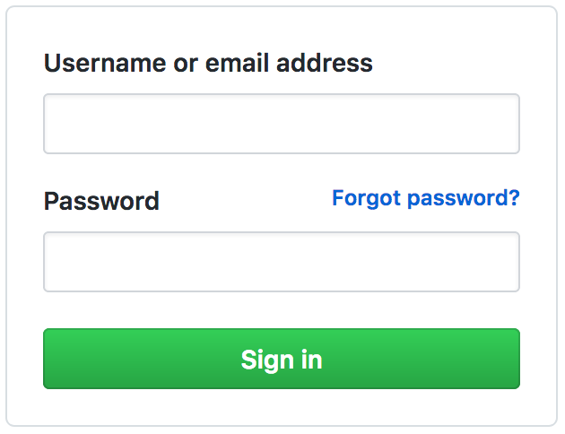
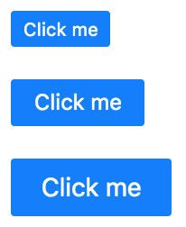

# Solution

Matry will rely on several key concepts, which will be explored in this document.

#### Table of Contents

[Projects](#projects)  
[Tokens](#tokens)  
[Components](#components)  
[Nodes](#nodes)  
[State](#state)  
[Swatches](#swatches)  
[Stories](#stories)  

---

### <a name="projects"/>Projects</a>

All work in Matry is localized to a workspace called a Project. Projects have the following attributes:

- Title  
- Description  
- Version  
- Created (date)  
- Last Modified (date)  
- Tokens  
- Components  
- Stories

A project can be cloned, deleted, and branched. Versioning details TBD. Projects will also be exported to a variety of presentational and transferrable formats, such as PDF, PNG, JSON, YAML, Adobe AI, Adobe PS, and Sketch. A static site can also be generated and uploaded to Github Pages or Gitlab Pages.

---

### <a name="tokens"/>Tokens</a>

The name "Token" originated after designers observed web developers usage of SCSS/LESS variables. A token is a globally defined style value that can be reused in any component.

In Matry, all tokens are grouped into the following types:

- **Color**: Color values, defined in hexidecimal format, rgba, and hsla.  
- **Font**: Font family definitions. Note that fonts do _not_ define styling, only the font source used.  
- **Image**: Image sources. Primarily defined by their href attribute.  
- **Icon**: Similar to images but with some helpful functionality related to icons specifically.  
- **Unit**: Numeric values indicating pixel dimensions. Grouped together, these form scales.  
- **Content**: Placeholder text content, such as lorem ipsum.  
- **Dimension**: State dimensions, along with their respective contexts. Dimensions are explained later in this document.  
- **Swatches**: Style definitions. Swatches are explained later in this document.  

---

### <a name="components"/>Components</a>

Components are the primary building blocks of the application. If a UI design can be thought of as a lego set, these are the lego pieces. Components have the following attributes:

- Title
- Description
- Category
- Dimensions
- Nodes
- Swatches

Dimensions, Nodes, and Swatches will be explored later in this document.

A design in Matry is intended to be built from the bottom up, meaning a designer will begin by creating the smallest components first. These may be items like buttons, text inputs, labels, headings, etc. Over time these can be combined together to form larger components. Consider the following example.

In order to design what is in the above screenshot, we might create 5 components with the following titles:

1. Label
2. Text Input
3. Link
4. Button
5. Login Form

The final component, Login Form, is where the first 4 are composed together. The Login Form would use:

- 2 _Label_ components - one for "Username or email address", and another for "Password"
- 2 _Text Input_ components - one for the username input and the other for the password
- 1 _Link_ component - for "Forgot Password?"
- 1 _Button_ component - for "Sign In"

Only one component can be created at a time, so each sub component has to be created first, before the Login Form. While this seems restrictive, it forces designers to think systematically, and approach each component as a thing _in and of itself_.

---

### <a name="nodes"/>Nodes</a>

Matry's architecture is guided by Separation of Concerns, meaning that the application distinguishes between _structure_ (the content of each component) and _style_ (the visual presentation of the component). Components in Matry, therefore, have their own structure that is entirely separate from their styling. Collectively, this is called a "Model", and a model consists of "Nodes".

A Node is similar to an HTML element. Like elements, nodes define the content schema (makeup) of a component. There are a few key differences, however. **(A)** Elements can be added to and removed from the DOM, but nodes are persistent. A node can be hidden from view, but once created, cannot be removed. **(B)** Elements describe both the schema of a document and the content that exists inside it. Nodes only describe the type of content that can be used, not the content itself.

Nodes have the following properties:

- Title
- Type
- Public

A node's "Type" defines the type of content that can be inserted into it. Types can be (1) "text", (2) "image", (3) "component", or (4) "container". A "container" node can only contain other nodes/components.

The "Public" attribute defines whether the content in this particular node can be overidden when the component is used by larger components. A node can either be public or private. The public nodes of a component can therefore be thought of as the components "interface".

---

### <a name="state"/>State</a>

In addition to nodes, a component also has "State". State, as the name suggests, defines the kinds of changes anticipated for the component.

In Matry, the concept of "state" is divided into 2 sub concepts - "Dimension" and "Context". Rather than try to explain these ideas in words, it is much easier to consider an example.

In the above screenshot, we see the same button represented in 3 different sizes. We can readily assume that each one of these can be described as a "state", so we can imagine that this button has 3 states - let's call them "small", "medium", and "large".

We might assume that we have described the state of the button, but in fact we have not. Because "small", "medium", and "large" **only defines one aspect of the state**. There could be several others. For instance, what if the button has a disabled state? If it does, we could call those states "enabled" and "disabled". The buttons in the picture don't look disabled, so we can assume that they are in the "enabled" state. So let's rename our states from "small", "medium", "large" to "small enabled", "medium enabled", and "large enabled".

It should be clear that this naming strategy will not scale. What if our button can change in a handful of ways, not just by size or enabled/disabled? The number of possible states grows exponentially.

The Matry philosophy is that any one "state" of a component cannot be directly named, because state itself is actually composed of several smaller states. This is where the notions of "dimension" and "context" come in handy.

A **Dimension** is a particular way in which a component can change state, and a **Context** is one particular variation within a dimension. Let's re-imagine how we define the button states from above, using dimension and context:

#### Button
- **Size**: Small, Medium, Large
- **Interaction**: Enabled, Disabled

The button now defines 2 dimensions - one for size, and another for interaction. The "size" dimension has 3 contexts - small, medium, and large. The "interaction" dimension has 2 contexts - enabled and disabled.

This schema is a subtle shift in the way we approach state, but it offers us far more flexible and descriptive power.

---

### <a name="swatches"/>Swatches</a>

The final item that comprises a component, after nodes and state, is a "Swatch". For those who know CSS, a swatch closely resembles a class. It targets a particular node on-screen and applies visual styling to it. But, as with "nodes vs html elements", there are some key differences between swatches and classes, as we'll explain. A swatch contains the following properties:

- **target**: The node that the swatch will be applied to.
- **contexts**: The contexts that must be activated for the swatch to be applied.
- **content**: The content of the node. This will either be text or an image, depending on the node type.
- **interaction**: The type of interaction that will trigger the swatch. Options are "rest", "hover", or "press".
- **styles**: A collection of key:value pairs, each describing a style property along with a style value.

As indicated, a swatch must contain (1) a node, (2) a context, and (3) a set of styles. By using this schema, we can describe in great detail how a component will visually change throughout its lifecycle.

---

### <a name="stories"/>Stories</a>

TBD
