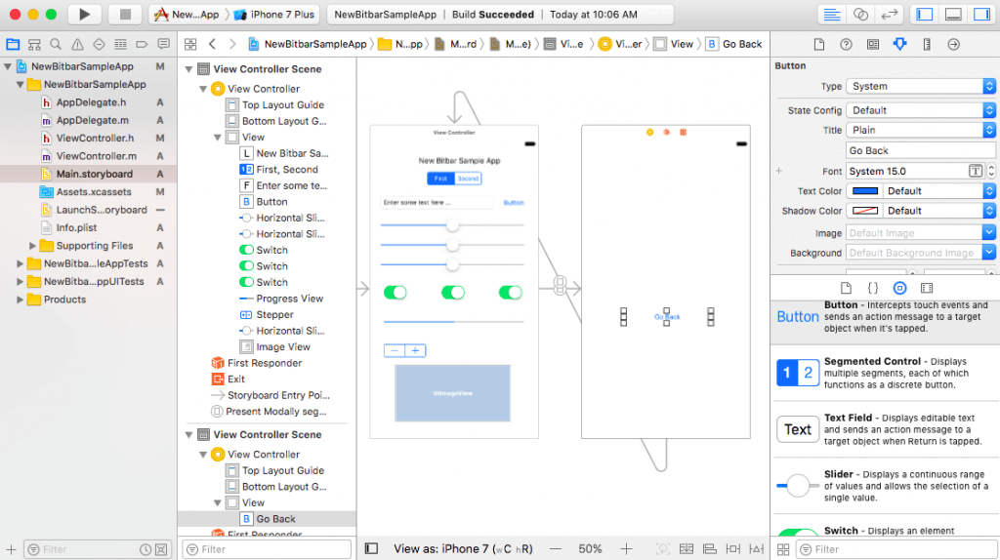

In the spring of 2022, I gave my first public talk about Matry.
The event was [SoFlo DevCon](https://techhubsouthflorida.org/meetups/soflodevcon), a conference for anything and everything tech related.

I chose this venue to introduce Matry because it's a tool that is intended to bring designers and developers closer together,
and this particular conference had content that spanned across all disciplines.
I was really hoping to have a good mixture in the crowd,
so I began my talk with a question, asking "who in here is a designer - can I get a raise of hands?"

Not a single person raised their hand.
A room full of developers, all hearing me talk about a language...for designers.
I laughed it off, but in truth I was somewhat dismayed.
After the talk I had a few questions, but not much general interest.

Developers just don't seem to be too interested in the idea.
I don't want to come off as _expecting_ excitement by any means,
but what's interesting is the delta between the two responses.

In fact, over the years I've noticed this trend where the design world is striving to work more closely with developers.
This is especially true in design tooling - Figma, Sketch, AdobeXD, Webflow, the list goes on.
Figma has especially been foward-leaning on this front, and have gone to great lengths to carve out a space in the design toolchain for developers.

Yet, while the design world is clearly aching for a more integrated workflow, the interest does not seem to be mutual.

When was the last time you saw a _developer tool_ carve out space for _designers_?
The only example I can think of is Storyboard, which is a GUI tool used by Apple's XCode for arranging the views of a Mac app (iOS, desktop, etc).
But the idea that a designer would actually use Storyboard is somewhat laughable to anyone who has used it.

So why aren't developers interested in bridging the gap with designers?
After all, the workflow is typically one-way - designs are handed off to developers for implementation.
So developers are in a better position to understand what they need from designers, and could build tooling that makes that hand-off easier.

I'm not going to opine on the reasons why, because I honestly don't know.
But what I am confident in stating is that it should change.
We need more of what I would call "design inclusivity" - we should be inviting designers to take a more active role in the development of our products.
